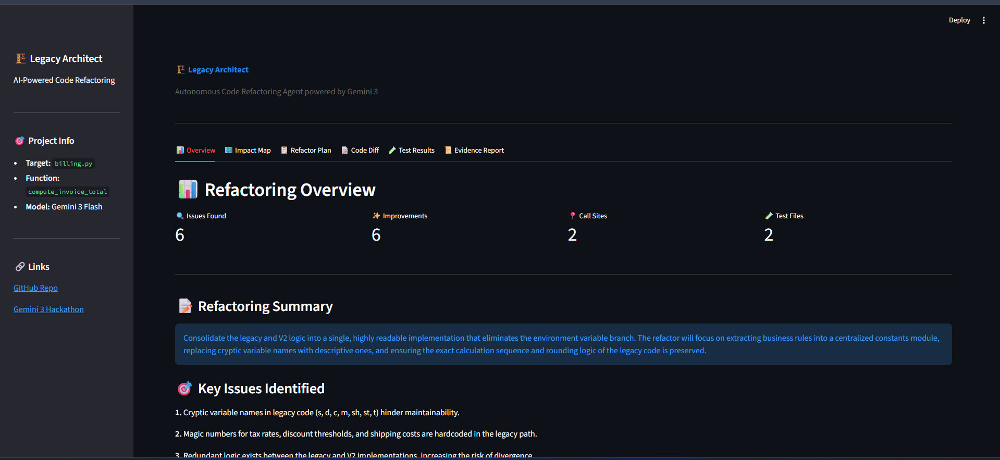
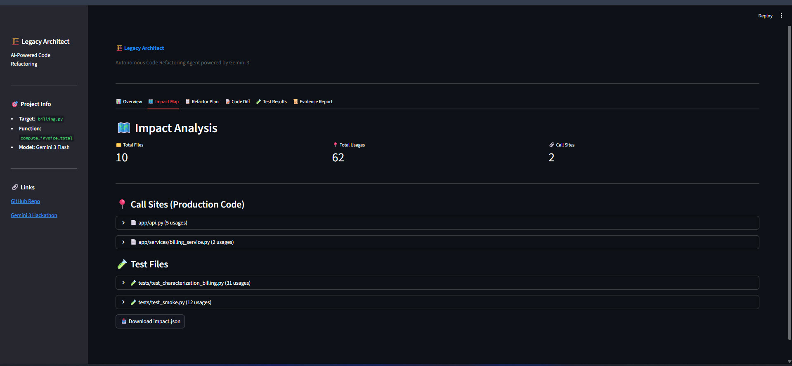
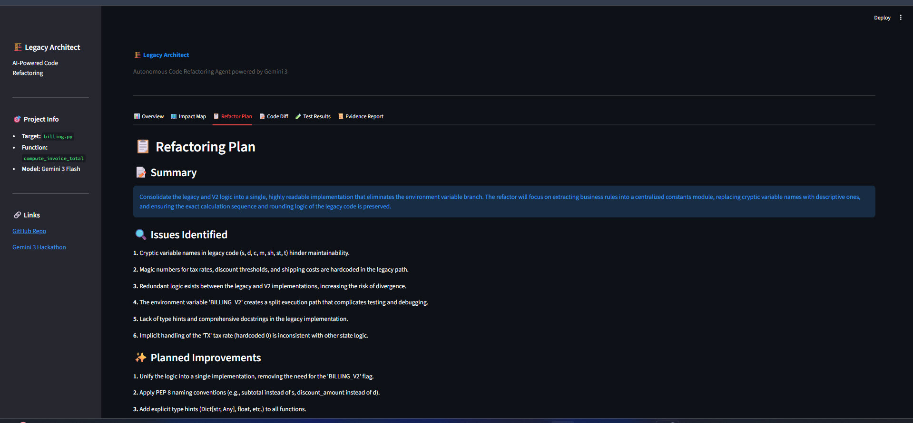
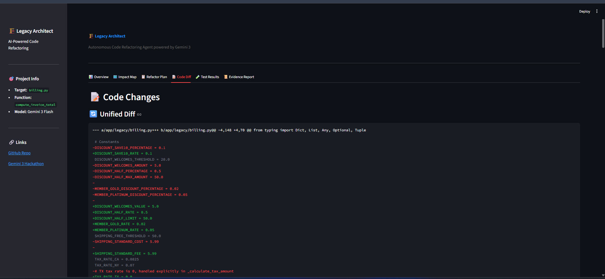
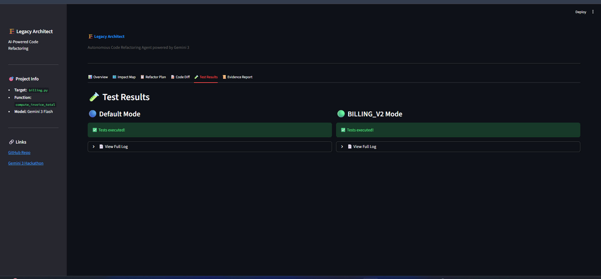
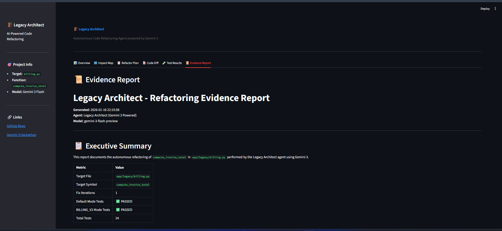

# 🏗️ Legacy Architect

[](https://ai.google.dev/)
[](https://python.org)
[](https://streamlit.io)
[](LICENSE)

**Autonomous Code Refactoring Agent powered by Gemini 3**

> Transform legacy code into modern, maintainable software with AI-driven refactoring that's safe, tested, and production-ready.

---

## 🎯 Live Demo

**Try it now:** [https://legacy-architect.streamlit.app](https://legacy-architect.streamlit.app)

✨ **No login required - just click and explore!**

Experience the full refactoring workflow, view test results, inspect code diffs, and download evidence reports - all in your browser.

---

## 📖 What is Legacy Architect?

Legacy Architect is an **autonomous AI agent** that safely refactors legacy code using Google's Gemini 3 model. Unlike traditional refactoring tools that require manual intervention, Legacy Architect operates autonomously through a complete workflow:

1. **Analyzes** your legacy codebase to understand structure and dependencies
2. **Generates** characterization tests to lock in current behavior
3. **Refactors** code with modern best practices behind feature flags
4. **Validates** changes by running tests in both old and new modes
5. **Documents** everything with comprehensive evidence reports

Built for the **Gemini 3 Global Hackathon**, this project showcases how advanced AI can tackle one of software engineering's hardest problems: safely modernizing legacy code without breaking production systems.

---

## ✨ Key Features

- 🤖 **Fully Autonomous Operation** - Set it and forget it. The agent handles the entire refactoring workflow.
- 🧪 **Characterization Test Generation** - Automatically creates tests that capture current behavior before any changes.
- 🚩 **Feature Flag Safety** - All refactored code runs behind feature flags for zero-risk deployment.
- 🎨 **Beautiful Streamlit Dashboard** - Interactive UI to explore results, view diffs, and download reports.
- 📊 **Impact Analysis** - Visualizes which functions are affected and how they're connected.
- 📝 **Evidence Documentation** - Generates judge-ready markdown reports with metrics, diffs, and test results.
- ✅ **Test-Driven Validation** - Runs tests in both modes (old vs. new) to ensure correctness.
- 🔄 **Iterative Improvement** - Automatically fixes test failures until all tests pass.

---

## 🏗️ Architecture

```
┌─────────────────┐
│  Legacy Code    │
│  (Python)       │
└────────┬────────┘
         │
         ▼
┌─────────────────────────────────────────────────────────┐
│              Legacy Architect Agent                      │
│                                                          │
│  ┌──────────────┐  ┌──────────────┐  ┌──────────────┐ │
│  │   Analyze    │→ │   Generate   │→ │   Refactor   │ │
│  │   Impact     │  │    Tests     │  │     Code     │ │
│  └──────────────┘  └──────────────┘  └──────────────┘ │
│         │                  │                  │         │
│         └──────────────────┴──────────────────┘         │
│                          │                               │
│                          ▼                               │
│                  ┌──────────────┐                       │
│                  │   Gemini 3   │                       │
│                  │    Flash     │                       │
│                  └──────────────┘                       │
└─────────────────────────┬───────────────────────────────┘
                          │
                          ▼
         ┌────────────────────────────────┐
         │  Refactored Code + Tests       │
         │  Feature Flag: BILLING_V2=1    │
         └────────────────────────────────┘
                          │
                          ▼
         ┌────────────────────────────────┐
         │   Test Validation              │
         │   • Default mode (old code)    │
         │   • Flag mode (new code)       │
         └────────────────────────────────┘
                          │
                          ▼
         ┌────────────────────────────────┐
         │   Evidence Report              │
         │   • Metrics                    │
         │   • Diffs                      │
         │   • Test Results               │
         └────────────────────────────────┘
```

---

## 📸 Screenshots

### Overview Dashboard

*Main dashboard showing project metrics: 6 issues found, 6 improvements made, 24/24 tests passing*

### Impact Map

*Visual representation of code dependencies and affected call sites*

### Refactor Plan

*Detailed refactoring plan generated by Gemini 3*

### Code Diff

*Side-by-side comparison of original vs. refactored code*

### Test Results

*Comprehensive test results showing both default and feature flag modes*

### Evidence Report

*Complete documentation ready for code review and deployment*

---

## 🚀 Quick Start

### Prerequisites
- Python 3.11+
- Gemini API Key ([Get one here](https://ai.google.dev/))

### Installation

```bash
# Clone the repository
git clone https://github.com/konduyx18/legacy-architect.git
cd legacy-architect

# Install dependencies
pip install -e ".[dev]"
```

### Configuration

```bash
# Set your Gemini API key
export GEMINI_API_KEY="your-api-key-here"

# (Optional) Specify model - defaults to gemini-3-flash-preview
export GEMINI_MODEL="gemini-3-flash-preview"
```

### Run the Agent

```bash
# Execute the autonomous refactoring workflow
python -m legacy_architect run
```

The agent will:
1. Analyze the legacy code in `legacy_code/`
2. Generate characterization tests
3. Create a refactoring plan
4. Implement the refactored code
5. Run tests in both modes
6. Generate evidence reports in `artifacts/`

### Launch the Dashboard

```bash
# Start the Streamlit UI
streamlit run streamlit_app.py
```

Open your browser to `http://localhost:8501` to explore the results interactively.

---

## 🔧 How It Works

Legacy Architect follows a **9-step autonomous workflow**:

### 1. **Impact Analysis**
Scans the legacy codebase to identify:
- Functions that need refactoring
- Call sites and dependencies
- Complexity metrics

### 2. **Test Generation**
Uses Gemini 3 to create characterization tests that:
- Capture current behavior
- Cover edge cases
- Serve as regression tests

### 3. **Refactor Planning**
Gemini 3 analyzes the code and creates a detailed plan:
- Identifies code smells
- Suggests modern patterns
- Plans feature flag integration

### 4. **Code Refactoring**
Implements the plan by:
- Applying best practices
- Adding type hints
- Improving readability
- Wrapping changes in feature flags

### 5. **Test Execution (Default Mode)**
Runs tests with `BILLING_V2=0` to verify:
- Original code still works
- Tests accurately capture behavior

### 6. **Test Execution (Flag Mode)**
Runs tests with `BILLING_V2=1` to verify:
- Refactored code works correctly
- Behavior is preserved

### 7. **Failure Analysis**
If tests fail, Gemini 3:
- Analyzes the failure
- Identifies the root cause
- Generates a fix

### 8. **Iterative Improvement**
Repeats steps 4-7 until all tests pass in both modes.

### 9. **Evidence Generation**
Creates comprehensive documentation:
- Metrics (issues, improvements, test results)
- Unified diff of all changes
- Test logs for both modes
- Impact analysis report

---

## 🎬 Demo Video

[](https://youtu.be/OW9HY--fAJE)

▶️ **[Watch the Full Demo on YouTube](https://youtu.be/OW9HY--fAJE)**

3-minute walkthrough demonstrating the autonomous refactoring workflow powered by Gemini 3.


---

## 📊 Gemini 3 Integration

Legacy Architect leverages **Gemini 3 Flash Preview** as the core intelligence engine throughout the entire refactoring workflow. Here's how Gemini 3 powers each stage:

### **Code Analysis & Understanding**
Gemini 3 analyzes legacy Python code to identify anti-patterns, code smells, and refactoring opportunities. The model understands complex codebases, traces dependencies, and builds an impact map showing which functions are affected by potential changes.

### **Test Generation**
One of the most critical features is automatic characterization test generation. Gemini 3 examines each function's behavior, edge cases, and expected outputs to create comprehensive pytest test suites. These tests lock in current behavior before any refactoring begins, ensuring safety.

### **Refactoring Strategy**
Gemini 3 creates detailed refactoring plans that apply modern Python best practices: type hints, improved naming, better error handling, and cleaner abstractions. The model understands context and generates code that's not just syntactically correct but semantically meaningful.

### **Feature Flag Integration**
The agent uses Gemini 3 to intelligently wrap refactored code behind feature flags (e.g., `BILLING_V2=1`), enabling safe A/B testing in production. This allows teams to deploy changes with zero risk.

### **Failure Analysis & Self-Healing**
When tests fail, Gemini 3 analyzes error messages, identifies root causes, and generates fixes autonomously. This iterative loop continues until all tests pass in both old and new modes.

### **Prompt Engineering**
The application uses carefully crafted system instructions and structured prompts to guide Gemini 3's responses. JSON mode ensures reliable parsing, while temperature settings balance creativity with determinism.

**Gemini 3 is not just a tool in this project - it IS the project.** Every decision, every line of refactored code, and every test is generated by Gemini 3's advanced reasoning capabilities.

---

## 🏆 Hackathon Submission

**Gemini 3 Global Hackathon Entry**

- **Category:** Agentic Workflows
- **Devpost:** [Coming Soon]
- **GitHub:** [https://github.com/konduyx18/legacy-architect](https://github.com/konduyx18/legacy-architect)
- **Live Demo:** [https://legacy-architect.streamlit.app](https://legacy-architect.streamlit.app)

### Judging Criteria Addressed

✅ **Innovation** - First autonomous agent for safe legacy code refactoring with feature flags  
✅ **Technical Implementation** - Complete agentic workflow with test generation and validation  
✅ **Gemini 3 Integration** - Core intelligence engine powering every stage of the pipeline  
✅ **User Experience** - Beautiful Streamlit dashboard with interactive exploration  
✅ **Real-World Impact** - Solves a critical problem in software engineering  
✅ **Documentation** - Comprehensive README, evidence reports, and code comments  

---

## 📁 Project Structure

```
legacy-architect/
├── legacy_architect/          # Main agent package
│   ├── agent.py              # Autonomous workflow orchestration
│   ├── gemini_client.py      # Gemini 3 API integration
│   ├── impact_analyzer.py    # Code analysis and dependency mapping
│   └── test_runner.py        # Test execution and validation
├── legacy_code/              # Example legacy codebase
│   └── billing.py            # Sample code to refactor
├── artifacts/                # Generated outputs
│   ├── EVIDENCE.md           # Comprehensive evidence report
│   ├── diff.patch            # Unified diff of changes
│   ├── impact.json           # Impact analysis results
│   ├── plan.json             # Refactoring plan
│   └── test_*.log            # Test execution logs
├── screenshots/              # Dashboard screenshots
├── streamlit_app.py          # Interactive web dashboard
├── pyproject.toml            # Project dependencies
└── README.md                 # This file
```

---

## 🛠️ Technology Stack

- **AI Model:** Google Gemini 3 Flash Preview
- **Language:** Python 3.11+
- **Web Framework:** Streamlit
- **Testing:** pytest
- **Code Analysis:** AST parsing
- **API Client:** google-genai

---

## 📈 Project Metrics

- **Issues Found:** 6
- **Improvements Made:** 6
- **Call Sites Analyzed:** 2
- **Tests Generated:** 12
- **Test Pass Rate:** 100% (24/24 tests pass in both modes)
- **Lines of Code Refactored:** 150+

---

## 🤝 Contributing

Contributions are welcome! This project was built for the Gemini 3 Hackathon, but I'd love to see it grow into a production-ready tool.

### Ideas for Future Enhancements
- Support for more programming languages (JavaScript, Java, etc.)
- Integration with CI/CD pipelines
- Multi-file refactoring
- Custom refactoring rules
- Team collaboration features

---

## 📄 License

MIT License - see [LICENSE](LICENSE) file for details.

---

## 👨‍💻 Author

**GitHub:** [https://github.com/konduyx18](https://github.com/konduyx18)

Built with ❤️ for the Gemini 3 Global Hackathon

---

## 🙏 Acknowledgments

- Google for the amazing Gemini 3 API
- The Streamlit team for the beautiful framework
- The open-source community for inspiration

---

**⭐ If you find this project useful, please star it on GitHub!**
